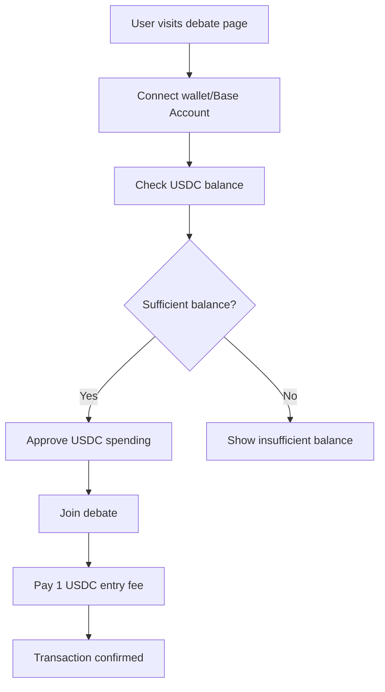
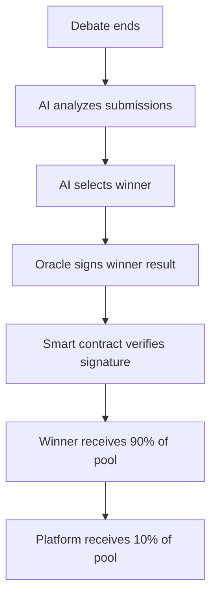

# Complete Base Sepolia Integration Guide

This guide covers the complete integration of your NewsCast Debate app with Base Sepolia, including Base Account SDK for gasless transactions.

## 🎯 Overview

Your app now supports:
- ✅ **USDC Entry Fees** - Users pay 1 USDC to join debates
- ✅ **Automated Payouts** - Winners receive 90% of pool, platform keeps 10%
- ✅ **Gasless Transactions** - Base Account SDK integration for seamless UX
- ✅ **AI-Judged Results** - Oracle signs winner decisions with EIP-712
- ✅ **Modular Architecture** - Easy to extend and maintain

## 🚀 Quick Start

### 1. Deploy the Complete System

```bash
# Set your environment variables
export PRIVATE_KEY="your_deployer_private_key"
export ORACLE_ADDRESS="your_oracle_wallet_address"
export ORACLE_PRIVATE_KEY="your_oracle_private_key"

# Run the complete deployment
./deploy-complete-system.sh
```

### 2. Test the Integration

```bash
# Test the smart contract
cd contracts
DEBATE_POOL_CONTRACT_ADDRESS=0x... npm run test:contract

# Test the frontend
npm run dev
# Visit http://localhost:3000
```

## 🔧 Component Integration

### Frontend Components

#### 1. GaslessPayment Component

```tsx
import GaslessPayment from '@/components/GaslessPayment';

// In your debate page
<GaslessPayment
  debateId={1}
  entryFee="1"
  onPaymentSuccess={(txHash) => {
    console.log('Payment successful:', txHash);
    // Update UI, show success message
  }}
  onPaymentError={(error) => {
    console.error('Payment failed:', error);
    // Show error message to user
  }}
/>
```

#### 2. Base Account Service

```tsx
import { getBaseAccountService } from '@/lib/services/base-account-service';

const baseAccountService = getBaseAccountService();

// Check if Base Account is available
if (baseAccountService.isAvailable()) {
  // Sign in with Base Account
  const { address } = await baseAccountService.signInWithBase();
  
  // Execute gasless transaction
  const txHash = await baseAccountService.joinDebateGasless(debateId);
}
```

### Backend Integration

#### 1. Oracle Service

```typescript
import { createDebateOracle } from './debate-oracle';

const oracle = createDebateOracle();

// Process battle completion and declare winner
await oracle.processBattleCompletion(battleId);
```

#### 2. Battle Manager Integration

The battle manager automatically integrates with the oracle:

```typescript
// In battle-manager-db.ts
if (this.oracle) {
  try {
    console.log(`🔗 Processing on-chain payout for battle ${battleId}`);
    await this.oracle.processBattleCompletion(battleId);
    console.log(`✅ On-chain payout processed successfully`);
  } catch (error) {
    console.error(`❌ Failed to process on-chain payout:`, error);
  }
}
```

## 📋 Smart Contract Functions

### View Functions

```solidity
// Get debate details
function getDebate(uint256 debateId) external view returns (Debate memory)

// Get all active debates
function getActiveDebates() external view returns (uint256[])

// Get user's debate history
function getUserDebates(address user) external view returns (uint256[])

// Get contract USDC balance
function getContractBalance() external view returns (uint256)
```

### Write Functions

```solidity
// Create a new debate (owner only)
function createDebate(
    string memory topic,
    uint256 entryFee,
    uint256 maxParticipants,
    uint256 duration
) external returns (uint256)

// Join a debate by paying entry fee
function joinDebate(uint256 debateId) external

// Declare winner (oracle only)
function declareWinner(WinnerResult memory result) external
```

## 🔐 Security Features

### EIP-712 Signature Verification

Winner results are signed using EIP-712 typed data:

```typescript
const domain = {
  name: 'DebatePool',
  version: '1',
  chainId: 84532, // Base Sepolia
  verifyingContract: contractAddress
};

const types = {
  WinnerResult: [
    { name: 'debateId', type: 'uint256' },
    { name: 'winner', type: 'address' },
    { name: 'timestamp', type: 'uint256' }
  ]
};
```

### Access Controls

- **Owner**: Can create debates and withdraw fees
- **Oracle**: Can declare winners (AI judge backend)
- **Participants**: Can join debates and receive rewards

## 🧪 Testing

### 1. Contract Testing

```bash
cd contracts
npm test
npm run test:contract
```

### 2. Integration Testing

```bash
# Test complete flow
npm run test:integration
```

### 3. Manual Testing

1. **Deploy to Base Sepolia**
2. **Fund test wallets with USDC**
3. **Create test debate**
4. **Join debate with multiple participants**
5. **Declare winner using oracle**
6. **Verify USDC distribution**

## 📊 Economics

### Fee Structure

- **Entry Fee**: 1 USDC per participant
- **Winner Prize**: 80% of total pool
- **Platform Fee**: 20% of total pool

### Example Payout

```
10 participants × 1 USDC = 10 USDC total pool
Winner receives: 8 USDC (80%)
Platform receives: 2 USDC (20%)
```

## 🔄 User Flow

### 1. User Joins Debate



### 2. AI Judges and Declares Winner



## 🛠️ Development

### Adding New Features

1. **Extend Interface**: Add new functions to `IDebatePool.sol`
2. **Implement Contract**: Add logic to `DebatePool.sol`
3. **Update Tests**: Add test cases for new functionality
4. **Deploy & Test**: Deploy to testnet and verify

### Common Patterns

- **Events**: Emit events for all state changes
- **Modifiers**: Use modifiers for access control
- **Error Messages**: Provide clear error messages
- **Documentation**: Document all public functions

## 🚨 Security Considerations

### Oracle Security

- **Key Management**: Use hardware wallets for oracle keys
- **Multi-sig**: Consider multi-sig for oracle operations
- **Monitoring**: Monitor oracle transactions and signatures

### Contract Security

- **Audits**: Get professional audits before mainnet
- **Testing**: Comprehensive test coverage
- **Monitoring**: Monitor contract events and state

## 📚 Resources

- [Base Documentation](https://docs.base.org)
- [Base Account SDK](https://docs.base.org/account-sdk)
- [OpenZeppelin Contracts](https://docs.openzeppelin.com/contracts/)
- [EIP-712 Standard](https://eips.ethereum.org/EIPS/eip-712)
- [Hardhat Documentation](https://hardhat.org/docs)

## 🤝 Contributing

1. Fork the repository
2. Create a feature branch
3. Make your changes
4. Add tests
5. Submit a pull request

## 📄 License

MIT License - see LICENSE file for details

---

**Your on-chain debate system is now ready for Base Sepolia!** 🎉

The complete integration provides:
- Seamless USDC payments
- Gasless transactions via Base Account SDK
- AI-judged results with cryptographic verification
- Automated reward distribution
- Modular, scalable architecture

Start testing and building your community! 🚀
