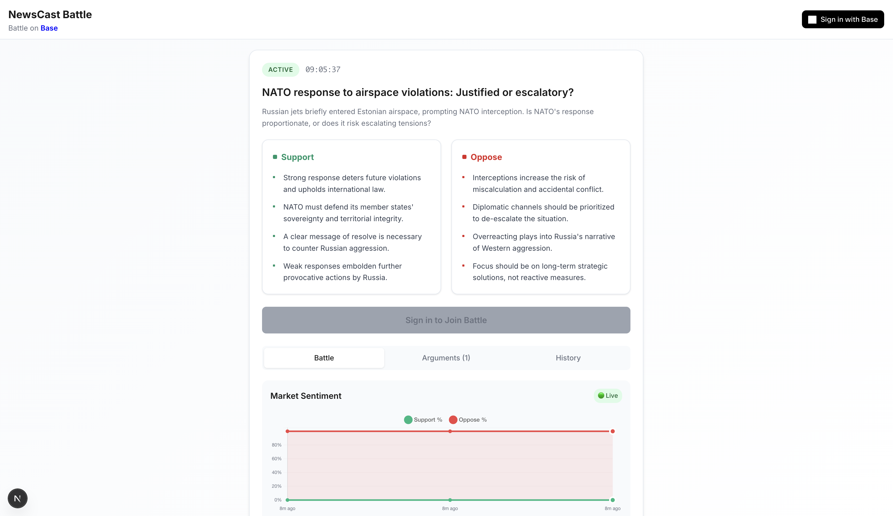

# NewsCast Battle

<div align="center">
  
  
  **AI-Powered News Debate Platform on Base Network**
  
  [](https://base.org)
  [](https://nextjs.org)
  [](https://docs.base.org/onchainkit)
  [](https://ai.google.dev)
</div>

## Overview

NewsCast Battle transforms trending global news into engaging debate battles on the Base network. Users participate through Farcaster Frames, submit their arguments, and compete for $BATTLE tokens. Our sophisticated multi-agent AI system curates high-impact news, generates balanced debate topics, and moderates content quality in real-time.

## Screenshot

<div align="center">
  
  
  *NewsCast Battle - AI-Powered News Debate Platform*
</div>

## Architecture

### Core Components

- **Frontend**: Next.js 15 with OnchainKit integration
- **AI System**: Multi-agent architecture using Google Gemini
- **Blockchain**: Base network with ERC-20 $BATTLE token
- **Frames**: Interactive Farcaster Frame endpoints
- **Data**: Real-time news from NewsAPI

### AI Agent System

Our sophisticated multi-agent AI system consists of specialized agents working in harmony:

1. **News Curator Agent** - Discovers and filters high-impact global news across politics, technology, crypto, and business sectors
2. **Debate Generator Agent** - Transforms curated news into balanced debate topics with compelling pro/con arguments
3. **Moderator Agent** - Evaluates content quality, appropriateness, and ensures respectful discourse
4. **Judge Agent** - Determines battle winners using advanced hybrid scoring algorithms combining quality, engagement, and AI analysis

## Features

### 🎯 Battle System
- **Configurable Duration**: Battles can be set from 2 minutes to 24 hours with automatic transitions
- **Real-time Participation**: Join battles via Farcaster Frames with instant updates
- **Token Rewards**: Win $BATTLE tokens for quality arguments and engagement
- **AI Moderation**: Advanced automated content quality assessment and similarity detection
- **Automatic Generation**: New battles start immediately when previous ones end with intelligent topic diversification

### 🔗 OnchainKit Integration
- **Wallet Connection**: Seamless Base wallet integration with Base Account SDK
- **Token Operations**: Native $BATTLE token handling and balance management
- **Transaction Management**: Built-in transaction processing with error handling
- **Multi-wallet Support**: MetaMask, Coinbase Wallet, WalletConnect with priority ordering

### 📱 Farcaster Frames
- **Interactive Cards**: Rich Frame experiences with dynamic content
- **Battle Participation**: Join battles directly from Farcaster with one-click integration
- **Cast Submission**: Submit arguments through Frames with real-time validation
- **Real-time Updates**: Live battle status, results, and participant tracking

### 🤖 Advanced AI Features
- **Intelligent Topic Diversification**: AI-powered similarity detection prevents repetitive topics
- **Multi-Strategy Retry Logic**: Automatic category switching when topics are too similar
- **Semantic Analysis**: Advanced AI similarity scoring for topic uniqueness
- **Quality Assessment**: Comprehensive content evaluation with scoring algorithms
- **Cache Optimization**: Battle-duration-aligned caching for optimal performance

## Tokenomics

**$BATTLE Token (ERC-20 on Base)**
- **Total Supply**: 1,000,000,000 tokens
- **Distribution**:
  - 40% Battle rewards (400M tokens)
  - 25% Community treasury (250M tokens)
  - 20% Team allocation (200M tokens)
  - 15% Project treasury (150M tokens)

## Quick Start

### Prerequisites

- Node.js 18+
- Base network access
- NewsAPI key (free tier available)
- Google Gemini API key
- Alchemy API key

### Installation

```bash
# Clone the repository
git clone https://github.com/battleonbase-pro/newscast-battle-onbase-app.git
cd newscast-battle-onbase-app

# Install dependencies
npm install

# Set up environment variables
cp .env.sample .env
# Edit .env with your API keys
```

### Environment Setup

Required API keys in `.env`:

#### 1. News API Key (Choose One)

**Option A: Currents API (Default)**
- Visit [Currents API](https://currentsapi.services/)
- Sign up for a free account
- Get your API key from the dashboard
- Add it to `CURRENTS_API_KEY` in your `.env` file

**Option B: Serper API (Alternative)**
- Visit [Serper API](https://serper.dev/)
- Sign up for a free account (100 free searches/month)
- Get your API key from the dashboard
- Add it to `SERPER_API_KEY` in your `.env` file
- Set `NEWS_SOURCE=serper` to use Serper instead of Currents

#### 2. Other Required Keys

```env
# OnchainKit Configuration
NEXT_PUBLIC_ONCHAINKIT_API_KEY=your_alchemy_api_key

# News API Configuration (Choose One)
CURRENTS_API_KEY=your_currents_api_key
SERPER_API_KEY=your_serper_api_key
NEWS_SOURCE=currents  # Options: 'currents' or 'serper'

# AI Configuration
GOOGLE_GENERATIVE_AI_API_KEY=your_google_gemini_api_key

# Contract Address (set after deployment)
NEXT_PUBLIC_BATTLE_TOKEN_ADDRESS=

# Battle Configuration (Optional)
BATTLE_DURATION_HOURS=0.033333  # 2 minutes (configurable)
BATTLE_MAX_PARTICIPANTS=1000
BATTLE_GENERATION_ENABLED=true
```

### Battle Configuration

The battle duration is fully configurable via environment variables:

| Duration | BATTLE_DURATION_HOURS | Use Case |
|----------|----------------------|----------|
| 2 minutes | `0.033333` | Fast-paced testing |
| 5 minutes | `0.083333` | Quick battles |
| 30 minutes | `0.5` | Standard battles |
| 1 hour | `1` | Extended battles |
| 24 hours | `24` | Daily battles |


### Development

```bash
# Start development server
npm run dev

# Open browser
open http://localhost:3000
```

### Smart Contract Deployment

```bash
# Deploy to Base mainnet
npm run deploy:token

# Deploy to Base Sepolia testnet
npm run deploy:testnet

# Run tests
npm test

# Run specific test suites
npm run test:news          # Test news API integration
npm run test:ai-similarity # Test AI similarity calculation
npm run test:retry-strategy # Test intelligent retry logic
npm run test:cache-key    # Test battle-duration cache alignment
```

## API Endpoints

### News & Topics
- `GET /api/news/trending-topics` - Current battle topic
- `POST /api/battle/create-battle` - Create new battle

### Farcaster Frames
- `GET /api/frame/battle-announcement` - Main battle frame
- `POST /api/frame/join-battle` - Join battle
- `POST /api/frame/submit-cast` - Submit argument
- `POST /api/frame/generate-topic` - Generate new topic

## How It Works

### 1. News Curation
Our News Curator Agent scans high-impact global news across multiple sectors (politics, technology, crypto, business), scoring articles for relevance and engagement potential using advanced filtering algorithms.

### 2. Debate Generation
The Debate Generator Agent transforms curated news into balanced debate questions with compelling pro/con arguments using sophisticated AI analysis and semantic understanding.

### 3. Battle Participation
Users join battles through Farcaster Frames, submit their arguments, and compete for $BATTLE tokens with real-time validation and feedback.

### 4. AI Moderation
The Moderator Agent evaluates content quality, appropriateness, and relevance during battle completion, ensuring respectful discourse and high-quality engagement.

### 5. Winner Selection
The Judge Agent determines winners using advanced hybrid scoring algorithms combining content quality, engagement metrics, and AI analysis for fair and accurate results.

## Technology Stack

- **Frontend**: Next.js 15, React 19, TypeScript
- **Blockchain**: Base network, OnchainKit, Viem, Wagmi
- **AI**: Google Gemini, Vercel AI SDK, Zod schemas
- **Data**: NewsAPI, Axios
- **Styling**: CSS Modules, Base design system

## Contributing

We welcome contributions! Please see our [Contributing Guidelines](CONTRIBUTING.md) for details.

### Development Workflow

1. Fork the repository
2. Create a feature branch
3. Make your changes
4. Add tests if applicable
5. Submit a pull request

## License

This project is licensed under the MIT License - see the [LICENSE](LICENSE) file for details.

## Support

- **Documentation**: [Base Docs](https://docs.base.org)
- **OnchainKit**: [OnchainKit Docs](https://docs.base.org/onchainkit)
- **Issues**: [GitHub Issues](https://github.com/battleonbase-pro/newscast-battle-onbase-app/issues)

## Roadmap

- [ ] Enhanced AI moderation algorithms with sentiment analysis
- [ ] Advanced tokenomics features including staking and governance
- [ ] Mobile app development for iOS and Android
- [ ] Cross-chain integration with Ethereum and other L2s
- [ ] Community governance system with voting mechanisms
- [ ] Advanced analytics dashboard for battle insights
- [ ] Integration with additional news sources and APIs

---

<div align="center">
  <p>Built with ❤️ on <a href="https://base.org">Base</a></p>
  <p>Powered by <a href="https://docs.base.org/onchainkit">OnchainKit</a></p>
</div>
